# HelsaGrace — Portfolio

The personal portfolio for **HelsaGrace Okporho** — Product Designer · UI/UX Designer ·
Full-Stack Developer · AI Enthusiast.

The site's job is simple: show that HelsaGrace doesn't only design interfaces — she takes
products from **idea to production**.

Primary statement: *"I design products. I also build them."*

## Stack

- **Next.js 15** (App Router) + **React 19** + **TypeScript** (strict)
- **Tailwind CSS v4** — design tokens declared once in `app/globals.css` via `@theme`
- **Supabase** — content storage, auth and Row-Level Security for the admin
- **Lucide React** for icons
- **Instrument Serif** + **Inter** self-hosted through `next/font`
- Deployed to **Vercel** / **Orizon**

## Architecture

```mermaid
flowchart TD

subgraph group_public["Public portfolio"]
  node_home["Portfolio page<br/>[page.tsx]"]
  node_hero["Hero<br/>[hero.tsx]"]
  node_work["Project work<br/>[work-section.tsx]"]
  node_capabilities["Capabilities"]
  node_process["Process"]
  node_stack["Technology stack<br/>[stack-section.tsx]"]
  node_about["About and stats<br/>[about-section.tsx]"]
  node_contactsection["Contact section"]
  node_caseimage["Case images<br/>[case-image.tsx]"]
  node_drawer["Case study drawer<br/>[project-drawer.tsx]"]
  node_tag["Project tags<br/>[tag.tsx]"]
  node_icons["Icon resolver<br/>[icons.ts]"]
end

subgraph group_content["Content services"]
  node_contentmodel["Content model and defaults<br/>[content.ts]"]
  node_cms["Content reader<br/>[cms.ts]"]
  node_supabase[("Supabase content store")]
  node_settings["Supabase configuration<br/>[env.ts]"]
end

subgraph group_admin["Content administration"]
  node_adminpages["Admin pages"]
  node_editors["Content editors"]
  node_controls["Editor controls<br/>[controls.tsx]"]
  node_adminactions["Admin actions<br/>[actions.ts]"]
  node_adminauth["Session and owner checks<br/>[server.ts]"]
  node_admindata["History, messages, media<br/>[admin-data.ts]"]
  node_adminui["Admin UI primitives<br/>[ui.tsx]"]
end

subgraph group_contact["Contact enquiries"]
  node_contactform["Contact form<br/>[contact-form.tsx]"]
  node_contactroute["Contact API route<br/>[route.ts]"]
  node_contactservice["Contact validation<br/>[contact.ts]"]
  node_resend["Resend email"]
end

subgraph group_motion["Motion and interaction"]
  node_intro["Intro experience<br/>[intro-provider.tsx]"]
  node_scroll["Smooth scrolling<br/>[smooth-scroll.tsx]"]
  node_reveal["Scroll reveal<br/>[reveal.tsx]"]
end

node_visitor(("Visitor"))
node_adminuser(("Portfolio owner"))

node_visitor -->|"visits"| node_home
node_home -->|"loads content"| node_cms
node_home -->|"wraps page"| node_intro
node_home -->|"renders"| node_hero
node_home -->|"renders"| node_work
node_home -->|"renders"| node_capabilities
node_home -->|"renders"| node_process
node_home -->|"renders"| node_stack
node_home -->|"renders"| node_about
node_home -->|"renders"| node_contactsection
node_cms -->|"merges defaults"| node_contentmodel
node_cms -->|"checks configuration"| node_settings
node_cms -->|"reads content"| node_supabase
node_work -->|"opens case study"| node_drawer
node_capabilities -->|"opens proof project"| node_drawer
node_drawer -->|"renders screenshots"| node_caseimage
node_drawer -->|"renders tags"| node_tag
node_hero -->|"uses scrolling"| node_scroll
node_intro -->|"uses scrolling"| node_scroll
node_capabilities -->|"resolves icons"| node_icons
node_adminuser -->|"manages content"| node_adminpages
node_adminpages -->|"uses editors"| node_editors
node_editors -->|"uses controls"| node_controls
node_editors -->|"uses primitives"| node_adminui
node_editors -->|"saves content"| node_adminactions
node_adminactions -->|"checks owner"| node_adminauth
node_adminactions -->|"reads content"| node_cms
node_adminactions -->|"writes content"| node_supabase
node_adminactions -->|"restores and lists"| node_admindata
node_adminauth -->|"checks session"| node_supabase
node_admindata -->|"reads admin data"| node_supabase
node_contactform -->|"posts enquiry"| node_contactroute
node_contactroute -->|"validates input"| node_contactservice
node_contactroute -->|"sends email"| node_resend

classDef toneNeutral fill:#f8fafc,stroke:#334155,stroke-width:1.5px,color:#0f172a
classDef toneBlue fill:#dbeafe,stroke:#2563eb,stroke-width:1.5px,color:#172554
classDef toneAmber fill:#fef3c7,stroke:#d97706,stroke-width:1.5px,color:#78350f
classDef toneMint fill:#dcfce7,stroke:#16a34a,stroke-width:1.5px,color:#14532d
classDef toneRose fill:#ffe4e6,stroke:#e11d48,stroke-width:1.5px,color:#881337
classDef toneIndigo fill:#e0e7ff,stroke:#4f46e5,stroke-width:1.5px,color:#312e81
classDef toneTeal fill:#ccfbf1,stroke:#0f766e,stroke-width:1.5px,color:#134e4a
class node_home,node_hero,node_work,node_capabilities,node_process,node_stack,node_about,node_contactsection,node_caseimage,node_drawer,node_tag,node_icons toneBlue
class node_contentmodel,node_cms,node_supabase,node_settings toneAmber
class node_adminpages,node_editors,node_controls,node_adminactions,node_adminauth,node_admindata,node_adminui toneMint
class node_contactform,node_contactroute,node_contactservice,node_resend toneRose
class node_intro,node_scroll,node_reveal,node_visitor,node_adminuser toneIndigo
```

[](https://gitdiagram.com/celebrityleftback19/helsagrace?utm_source=readme&utm_medium=badge)

[](https://gitdiagram.com/celebrityleftback19/helsagrace?utm_source=readme&utm_medium=picture)



## Getting started

```bash
npm install
npm run dev        # http://localhost:3000
npm run build      # production build
npm run start      # serve the production build
npm run typecheck  # tsc --noEmit
npm run seed       # load default content into Supabase (needs env)
```

The public site works with **no configuration at all** — it falls back to the content in
`lib/content.ts`. Supabase is only required to use the admin.

## Structure

```
app/
  layout.tsx            fonts, metadata, viewport
  page.tsx              reads content and composes the sections
  globals.css           design tokens + the little custom CSS there is
  admin/                content admin (login, dashboard, editors, server actions)
components/
  sections/             Hero, Work, Capabilities, Process, Stack, About, Contact
  admin/                admin UI: controls, editors, nav, login
  site-header.tsx       nav + mobile menu            ("use client")
  project-drawer.tsx    case-study slide-over + strips ("use client")
  contact-form.tsx      form interactions            ("use client")
  reveal.tsx            scroll reveal                ("use client")
  case-image.tsx        screenshot + graceful fallback ("use client")
lib/
  content.ts            content types + DEFAULT content
  cms.ts                reads live content from Supabase, merges over defaults
  icons.ts              icon-key → Lucide component
  supabase/             server client + middleware session helper
  admin-data.ts         revision history (authenticated)
supabase/
  schema.sql            tables, RLS policies, seed row
scripts/
  seed.ts               seeds defaultContent into Supabase
```

## Content admin (`/admin`)

All site content is editable from `/admin`: profile & hero, disciplines, projects and full
case studies (tags, meta, screenshots, sections, stack), capabilities, process, stack, and
about/stats. Saving writes to Supabase and calls `revalidatePath("/")`, so the live site
updates immediately.

### One-time setup

1. Create a Supabase project.
2. Run `supabase/schema.sql` in the Supabase **SQL editor**. This creates the content
   tables, the owner allowlist, the `is_admin()` helper, RLS policies, and the public
   `media` storage bucket for uploads.
3. Create an admin user in **Authentication → Users → Add user** (email + password).
4. **Add that email to the owner allowlist:**
   ```sql
   insert into public.admin_users (email) values ('you@example.com')
   on conflict do nothing;
   ```
   Only allowlisted emails can sign in or write — everything else is refused.
5. Copy `.env.example` to `.env.local` and fill in:
   - `NEXT_PUBLIC_SUPABASE_URL`
   - `NEXT_PUBLIC_SUPABASE_ANON_KEY`
   - `SUPABASE_SERVICE_ROLE_KEY` (only needed for seeding)
6. Run `npm run seed` to load the current content into the database.
7. Restart the dev server, visit `/admin`, and sign in.

### How it works

- Content is stored as a **single JSON document** (`site_content`, one row) plus an
  append-only **`content_revisions`** log. That keeps the schema trivial while still
  giving history and one-click restore from `/admin/history`.
- **Owner allowlist.** The `admin_users` table is the source of truth. A `SECURITY DEFINER`
  `is_admin()` function checks the signed-in email against it, and **every RLS policy uses
  it** — so even a valid Supabase user who isn't allowlisted cannot read revisions or write
  content. The app checks the same rule for a friendly error and to block sign-in.
- **Uploads & media library.** Screenshots upload to the public `media` bucket from either
  `/admin/media` or a project's screenshot field. `/admin/media` lists every upload with
  copy-URL and delete, and the editor's image fields have a **Library** picker so the same
  image can be reused across projects. `next.config.ts` allow-lists the Supabase storage host
  so `next/image` can optimise those URLs.
- **RLS**: anyone may read content (it's a public site); only allowlisted owners may write.
- Reading merges the stored document over the code defaults, so a field added in code later
  still renders until it's edited in the admin.
- **Capabilities are evidence-backed.** Each one pairs a one-line claim with a `decision`
  (the judgment worth defending) and a proof screenshot drawn from a linked project
  (`projectSlug` + `proofIndex`), so the skills section shows real work instead of asserting
  adjectives.
- Admin routes are gated in the server layout: unauthenticated visitors are redirected to
  `/admin/login`, non-owner accounts see a "not an owner" screen, and every write re-checks
  the allowlist. If Supabase isn't configured, `/admin` shows a setup notice instead.
- **Middleware is intentionally not used.** A Next.js Edge middleware bundle threw an
  `EvalError` ("Code generation from strings disallowed") under this local Node/Next
  combination, and the server layout already enforces the same rule. The trade-off is that
  the session is not proactively refreshed, so an owner signs in again when the access token
  expires (about an hour).

Add local screenshots to `public/images/` when you prefer to keep them in the repo — see
`public/images/README.md`.

## Contact form

The form posts to `app/api/contact` (a Next.js route handler) which emails you via
[Resend](https://resend.com). It validates input, includes a honeypot, and rate-limits per IP.

Set these in `.env.local` (and in Vercel):

- `RESEND_API_KEY` — from your Resend account. **Required**; without it the form reports
  "not configured" and sends nothing.
- `CONTACT_TO_EMAIL` — where enquiries land. Falls back to the profile email.
- `CONTACT_FROM_EMAIL` — the sender. It must be **an address on a domain you've verified in
  Resend** (add the DKIM / SPF / DMARC records Resend shows, then hit Verify). Until a domain
  is verified you can only send from Resend's test sender `onboarding@resend.dev`, which
  delivers **only to your own Resend account email** — so it's fine for testing, but you must
  verify a domain (e.g. `helsagrace.site`) before launch. `gmail.com` etc. cannot be used as a
  sender because you don't control the domain.

Submissions are also **stored in Supabase** (`contact_messages`) and shown under
`/admin/messages`, so nothing is lost even if the email fails.

## Before launch

- Update the real contact details in the admin (or in `lib/content.ts` defaults).
- Add a Resend API key and a verified `CONTACT_FROM_EMAIL` so the form actually sends.
- Add the remaining project screenshots — either to `public/images/` or by uploading them in
  the admin project editor.

## Architecture notes

- **Server Components by default.** `"use client"` is used only where the browser is
  genuinely required: mobile navigation, the project drawer, the contact form, scroll
  reveal, the screenshot error fallback, and the admin editors.
- **The project drawer** is driven by a small React context (`ProjectDrawerProvider`), so the
  Work section stays a server component while individual strips are interactive. It handles
  Escape-to-close, a focus trap, body scroll lock, and focus restoration.
- **Scroll reveal is progressive enhancement** — gated behind a `.js` class set before paint,
  so content is fully visible without JavaScript and respects `prefers-reduced-motion`.
- **No shadcn/ui components were needed.** Every surface here is bespoke, so the extra
  dependency was intentionally left out rather than added for its own sake.
